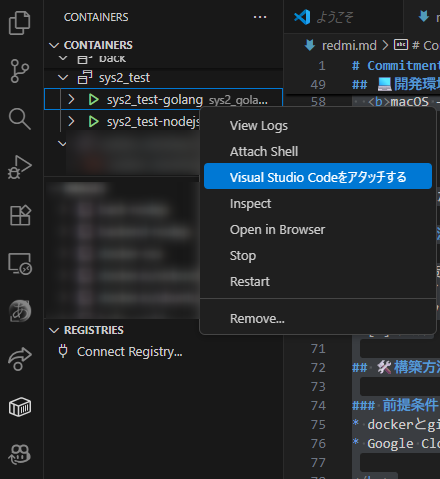

# 📌Commitment — BackendSystems
アプリケーションのバックエンドシステム

## ⚙️使用技術
<p align="center">
    
      
    
    
    </br>
    
    
    
    
</p>

### その他

<p align="center">
    
    
    
    
    
    
    
    
    
</p>


## 📔目次
- [特徴](#✅️特徴)
- [開発環境](#💻️開発環境)
- [構成](#📂構成)
- [開発状況](#📊開発状況)
- [構築方法](#構築方法)

## ✅️特徴
複数のコンテナを用いた高速な処理が特徴。

Nodejs,Go,Pythonのハイブリッド仕様で高速化を実現(予定)。

クラウドフル活用、バックエンドリーダーのお財布もフル活用。

## 💻️開発環境

<p align="center">
  
  
</p>

<p align="center">
  <b>Windows (Windows11 23H2 / Intel Core i5 12th Gen / 16 GB)</b><br/>
  <b>macOS — MacBook Air M4</b>
</p>


## 📂構成
--ここに画像が入ります--

## 📊開発状況

* [ ] 仕様策定
* [ ] デザイン完了
* [ ] バックエンド実装中
* [ ] 完成

## 🛠️構築方法

### 前提条件
* dockerとgitがインストールされている事。
* [Google Cloud CLIのセットアップ](GoogleCloudSetup.md)が完了している。


</br>

### 構築方法
</br>

1. リポジトリを任意の場所クローンしましょう。

```
git clone https://github.com/C0mmitment/Commitment_backend.git
```

2. コンテナを作成します。
* クローンしたディレクトリでPowerShellもしくはzshを開いてください。

### Windows

```
stard.bat
```

### MacOS
```
start.command
```

3. VSCodeでアタッチ



4. 各コンテナの初期設定
* この作業はアタッチしたコンテナ内のshellで行ってください。


* すべてのコンテナはこの場所で開発されています。
```
/usr/src/app
```

* コンテナを作成した最初は必ず、init.shを実行してください。
```
./init.sh
```


* 初期設定完了！ サーバーの実行は以下のコマンドで行うことができます。
```
./serv.sh
```

※Permissionで弾かれる場合は以下のコマンドを実行してください。
```
sudo chmod +x ./*.sh
``` 